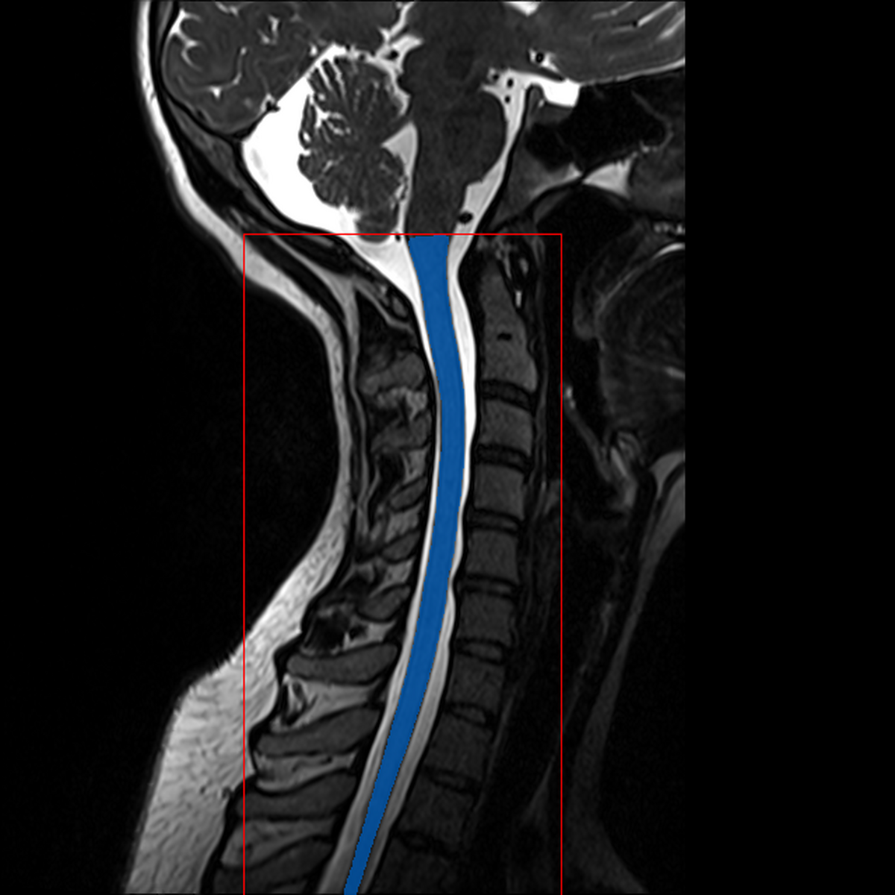
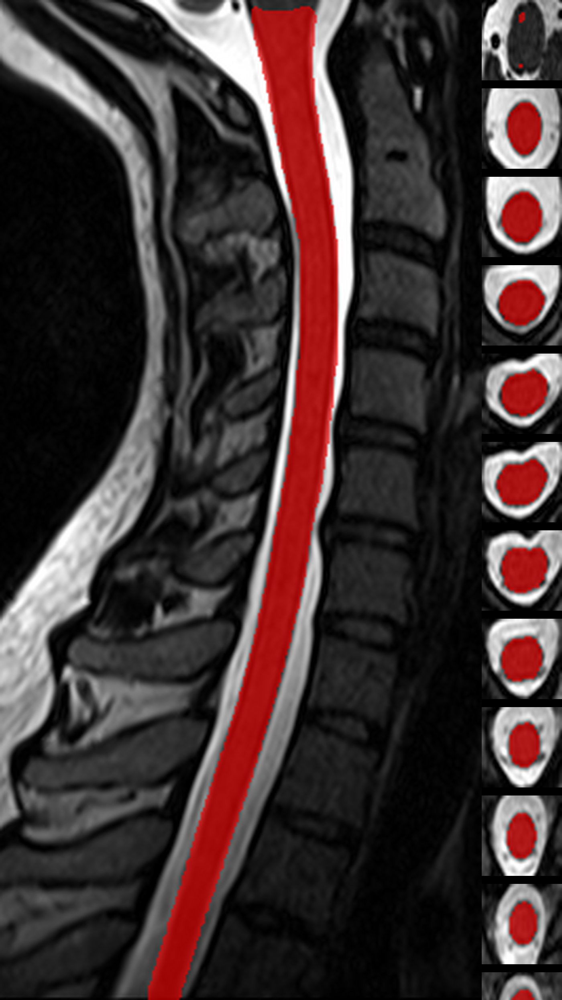
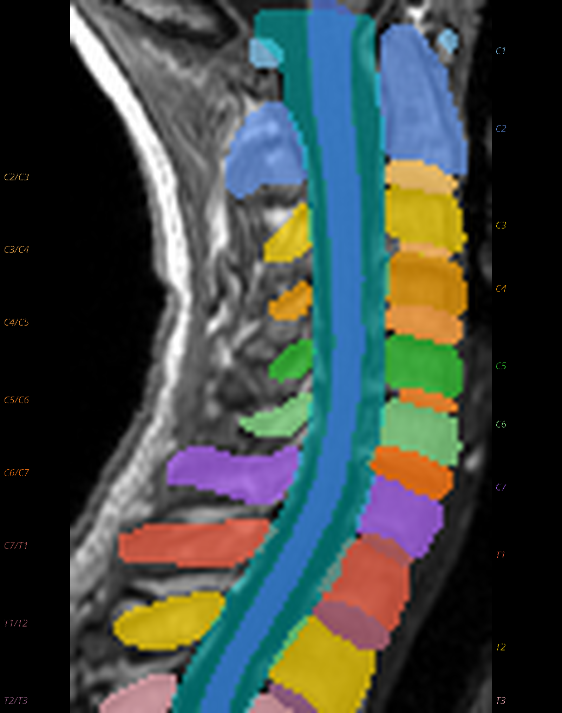
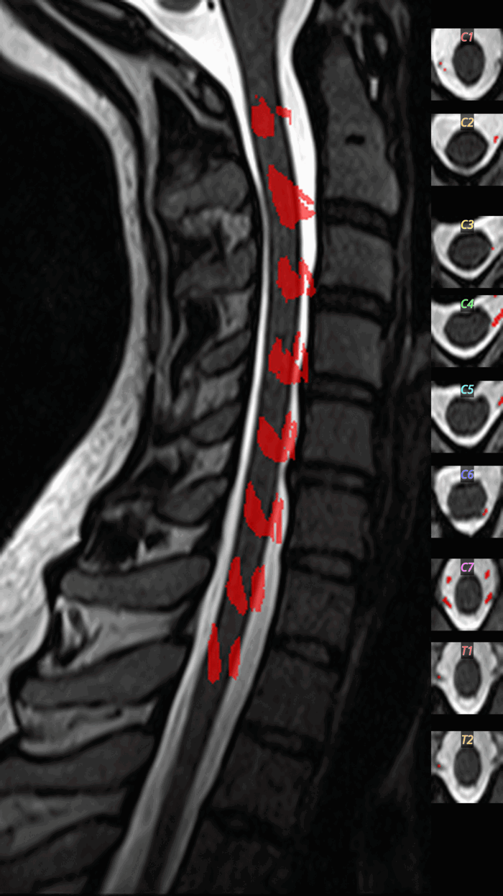
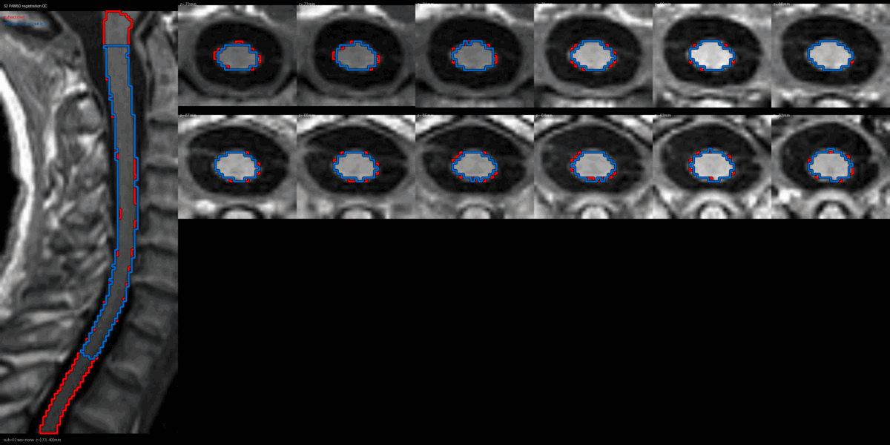

# S2: Anatomical Cord Reference

**Step Code:** `S2_anat_cordref`  
**Depends on:** S1 (Input Verification)  
**Required by:** S3-S11 (all downstream steps)

---

## Purpose

S2 establishes the **anatomical cord reference** that anchors all subsequent fMRI processing. The spinal cord presents unique challenges compared to brain imaging: its small cross-sectional area (~50-80 mm²), susceptibility to physiological motion, and variable vertebral anatomy across subjects. This step addresses these challenges by:

1. **Creating a standardized anatomical reference** for downstream registration
2. **Segmenting the spinal cord** for region-of-interest analyses
3. **Labeling vertebral levels** for spatial normalization
4. **Registering to the PAM50 template** for group-level analyses

---

## Algorithm Overview

The S2 step consists of four sequential substeps:

| Substep | Name | Description |
|---------|------|-------------|
| S2.1 | Discovery + Crop | Select anatomy, standardize, discover cord, crop |
| S2.2 | Segmentation + Labels | Cord segmentation, TotalSpineSeg for vertebrae/discs/canal |
| S2.3 | Rootlets | Dorsal nerve rootlet detection (conditional) |
| S2.4 | Registration | PAM50 template registration with dual-path strategy |

---

## S2.1: Discovery and Cropping

### Rationale

Spinal cord MRI often includes significant non-cord tissue (e.g., brainstem, shoulders) that can interfere with segmentation and registration algorithms. The discovery phase identifies the cord location and creates a cropped working volume.

### Algorithm

1. **Anatomy Selection** - Prefer T2w (better cord-CSF contrast), fallback to T1w
2. **Standardization** - Reorient to RPI via `sct_image -setorient RPI`
3. **Discovery Segmentation** - `sct_deepseg -task seg_sc_contrast_agnostic`
4. **FOV Validation** - Reject if cord coverage < 20 slices
5. **Cord-Focused Cropping** - `sct_crop_image -m <crop_mask>`

### QC: Crop Box Sagittal



**What to look for:**

- ✅ Blue contour (cord mask) follows the spinal cord
- ✅ Red contour (crop box) encompasses the full cord region
- ❌ FAIL: Crop box extends into brain or misses cord

---

## S2.2: Segmentation and Labeling

### Cord Segmentation Methods

| Method | Command | Best For |
|--------|---------|----------|
| `contrast_agnostic` (default) | `sct_deepseg -task seg_sc_contrast_agnostic` | CSA consistency |
| `totalspineseg` | Extract from TSS output | All-in-one |

### TotalSpineSeg Integration

TotalSpineSeg provides automatic instance segmentation:

- **Spinal cord** (label 1)
- **Spinal canal** (label 2)
- **Vertebrae** (labels 11-50: C1 through Sacrum)
- **Intervertebral discs** (labels 63-100: C2/C3 through L5/S)

**Command:** `sct_deepseg -task totalspineseg`

### Metrics Computed

- Cord volume (mm³), length (mm)
- CSA: mean, min, max (mm²)
- Vertebrae/discs detected
- Canal volume

### QC: Cord Segmentation Montage



**What to look for:**

- ✅ Cord mask is continuous across all slices
- ✅ Mask is centered on the cord
- ❌ FAIL: Large gaps or leakage into CSF

### QC: TotalSpineSeg Montage



Sagittal view showing colored vertebrae, discs, cord (blue), canal (cyan), with anatomical labels.

**What to look for:**

- ✅ Vertebrae are correctly ordered (no label jumps)
- ✅ Disc labels correspond to adjacent vertebrae
- ❌ FAIL: Missing vertebrae or shifted labels

---

## S2.3: Rootlets Detection

### Eligibility

- T2w image available
- Sufficient cord coverage
- Policy-enabled

**Command:** `sct_deepseg -task seg_spinal_rootlets`

### QC: Rootlets Montage



**What to look for:**

- ✅ Rootlets appear at dorsal-lateral positions
- ✅ Regular spacing along the cord
- ❌ FAIL: Rootlets detected ventrally (false positives)

---

## S2.4: Template Registration

### Strategy

Dual-path when rootlets available:

1. **Disc-based registration** - vertebral disc labels as landmarks
2. **Rootlet-based registration** - nerve rootlet entry points

**Command:** `sct_register_to_template`

### Output Warps

- `*_from-cordref_to-PAM50_warp.nii.gz` (forward)
- `*_from-PAM50_to-cordref_warp.nii.gz` (inverse)

### QC: PAM50 Registration Overlay



This animated GIF alternates between subject anatomy and template overlay.

**What to look for:**

- ✅ Cord contours align between subject and template
- ✅ No large rotational offsets
- ❌ FAIL: Significant misalignment (>5mm offset)

---

## Outputs

### Derivatives

```
derivatives/spinalfmriprep/{dataset}/sub-{id}/anat/
├── sub-{id}_desc-cordref_{T1w|T2w}.nii.gz
├── sub-{id}_desc-cord_dseg_{T1w|T2w}.nii.gz
├── sub-{id}_desc-canal_dseg_{T1w|T2w}.nii.gz
├── sub-{id}_desc-totalspineseg_dseg_{T1w|T2w}.nii.gz
├── sub-{id}_desc-vertebral_labels_{T1w|T2w}.nii.gz
├── sub-{id}_desc-disc_labels_{T1w|T2w}.nii.gz
└── sub-{id}_desc-rootlets_dseg_{T1w|T2w}.nii.gz (if eligible)

derivatives/spinalfmriprep/{dataset}/sub-{id}/xfm/
├── sub-{id}_from-cordref_to-PAM50_warp.nii.gz
└── sub-{id}_from-PAM50_to-cordref_warp.nii.gz

derivatives/spinalfmriprep/{dataset}/sub-{id}/figures/
├── sub-{id}_desc-S2_crop_box_sagittal.png
├── sub-{id}_desc-S2_cordmask_montage.png
├── sub-{id}_desc-S2_totalspineseg_montage.png
├── sub-{id}_desc-S2_rootlets_montage.gif (conditional)
└── sub-{id}_desc-S2_pam50_reg_overlay.gif
```

---

## CLI Usage

```bash
# Run S2 for a single dataset
poetry run spinalfmriprep run S2_anat_cordref \
  --dataset-key <KEY> \
  --datasets-local config/datasets_local.yaml \
  --out work/wf_001

# Run S2 for all regression datasets
poetry run spinalfmriprep run S2_anat_cordref \
  --scope reg \
  --datasets-local config/datasets_local.yaml \
  --out work/wf_001

# Validate outputs
poetry run spinalfmriprep check S2_anat_cordref --out work/wf_001
```

---

## References

1. **TotalSpineSeg:** Löffler et al. (2024). [GitHub](https://github.com/neuropoly/totalspineseg)
2. **SCT:** De Leener et al. *NeuroImage* 145:24-43 (2017). [DOI](https://doi.org/10.1016/j.neuroimage.2016.10.009)
3. **PAM50:** De Leener et al. *NeuroImage* 165:170-179 (2018). [DOI](https://doi.org/10.1016/j.neuroimage.2017.10.041)

---

*Last updated: January 2026*
